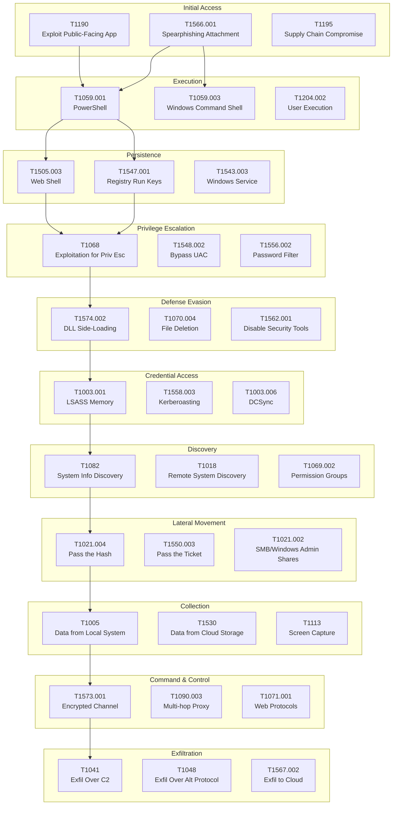

# {{title}} - Attack Chain Diagram

## MITRE ATT&CK Attack Chain Template

## Instructions
1. **Duplicate** this template for each campaign analysis
2. **Color-code** nodes:
   - 🔴 Red = Observed in campaign
   - 🟡 Yellow = Suspected/Probable
   - 🟢 Green = Not observed
   - ⚪ Gray = Not applicable
3. **Link** to relevant notes:
   - Click node → Add link to [[CTI/TTPs/TXXXX]] 
   - Link malware/tools: [[CTI/Malware/...]]
   - Link threat actors: [[CTI/Threat Actors/...]]
4. **Add evidence** in node comments (timestamps, IOCs, log sources)

## Example Usage
- [[CTI/Excalidraw/SolarWinds Attack Chain.excalidraw]]
- [[CTI/Excalidraw/APT28 Election Interference.excalidraw]]
- [[CTI/Excalidraw/Lazarus Crypto Heist.excalidraw]]

## Styling Tips
- Use **Frames** to group by tactic
- Use **Arrows** with labels for flow
- Use **Sticky Notes** for evidence/IOCs
- Embed **Images** (screenshots, PCAPs, logs)
- Add **Timestamps** on arrows for timeline