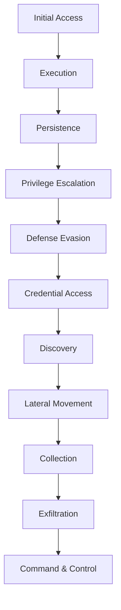

# {{title}} - Incident Report

## Overview
- **Incident ID:** {{incident-id}}
- **Title:** {{title}}
- **Date Detected:** {{detected-date}}
- **Date Occurred:** {{occurred-date}}
- **Status:** {{status}} (Open/Contained/Eradicated/Recovered/Closed)
- **Severity:** {{severity}} (Critical/High/Medium/Low/Informational)
- **Classification:** {{classification}} (Malware/Phishing/Unauthorized Access/Data Breach/DoS/Insider/Other)
- **Confidence Level:** {{confidence}}
- **Assigned Analyst:** {{analyst}}
- **Team:** {{team}}

## Timeline
| Timestamp (UTC) | Phase | Event | Details | Analyst |
|-----------------|-------|-------|---------|---------|
| {{ts-1}} | Detection | {{event-1}} | {{details-1}} | {{analyst-1}} |
| {{ts-2}} | Analysis | {{event-2}} | {{details-2}} | {{analyst-2}} |
| {{ts-3}} | Containment | {{event-3}} | {{details-3}} | {{analyst-3}} |
| {{ts-4}} | Eradication | {{event-4}} | {{details-4}} | {{analyst-4}} |
| {{ts-5}} | Recovery | {{event-5}} | {{details-5}} | {{analyst-5}} |
| {{ts-6}} | Lessons Learned | {{event-6}} | {{details-6}} | {{analyst-6}} |

## Initial Detection
- **Detection Method:** {{detection-method}} (EDR Alert/SIEM/Threat Hunt/User Report/Third Party/Other)
- **Detection Source:** {{detection-source}}
- **Initial Indicators:** {{initial-indicators}}

## Scope & Impact
### Affected Systems
| System/Asset | Hostname | IP | OS | Role | Impact Level |
|--------------|----------|----|----|------|--------------|
| {{asset-1}} | {{host-1}} | {{ip-1}} | {{os-1}} | {{role-1}} | {{impact-1}} |

### Data Impact
- **Data Types Accessed:** {{data-types}}
- **Data Exfiltrated:** {{exfiltrated}} (Yes/No/Unknown)
- **Volume:** {{volume}}
- **Classification:** {{data-classification}}

### Operational Impact
- **Systems Down:** {{systems-down}}
- **Services Affected:** {{services-affected}}
- **Business Impact:** {{business-impact}}
- **Estimated Cost:** {{cost}}

## Threat Intelligence Context
### Attributed Threat Actor
- **Actor:** [[CTI/Threat Actors/{{actor}}]]
- **Confidence:** {{attribution-confidence}}
- **Campaign:** [[CTI/Campaigns/{{campaign}}]]

### Malware/Tools Observed
| Malware/Tool | Type | Hash/IOC | Link |
|--------------|------|----------|------|
| {{malware-1}} | {{type-1}} | {{hash-1}} | [[CTI/Malware/{{malware-1}}]] |

### TTPs Observed
| Technique ID | Technique Name | Observation |
|--------------|----------------|-------------|
| T{{id-1}} | {{name-1}} | {{obs-1}} |

### IOCs Collected
> **Full IOC Collection:** [[CTI/IOCs/{{title}} IOCs]]

| Type | Value | Context | Source |
|------|-------|---------|--------|
| {{type-1}} | {{value-1}} | {{context-1}} | {{source-1}} |

## Attack Narrative
{{narrative}}

## MITRE ATT&CK Mapping

## Response Actions
### Containment
- {{containment-1}}
- {{containment-2}}

### Eradication
- {{eradication-1}}
- {{eradication-2}}

### Recovery
- {{recovery-1}}
- {{recovery-2}}

## Evidence Preservation
| Evidence | Type | Location | Hash | Custodian |
|----------|------|----------|------|-----------|
| {{evidence-1}} | {{type-1}} | {{loc-1}} | {{hash-1}} | {{custodian-1}} |

## Communications
| Date | Audience | Channel | Summary | Approved By |
|------|----------|---------|---------|-------------|
| {{date-1}} | {{audience-1}} | {{channel-1}} | {{summary-1}} | {{approver-1}} |

## Lessons Learned
### What Went Well
- {{went-well-1}}
- {{went-well-2}}

### What Could Be Improved
- {{improve-1}}
- {{improve-2}}

### Action Items
| Action | Owner | Due Date | Status |
|--------|-------|----------|--------|
| {{action-1}} | {{owner-1}} | {{due-1}} | {{status-1}} |

## References
- [[CTI/Reports/{{related-report}}]]
- External: {{external-ref}}

## Notes
{{notes}}

---
*Template based on TΞLΞMΞTRY's Obsidian CTI methodology*
*Last updated: {{date:YYYY-MM-DD}}*